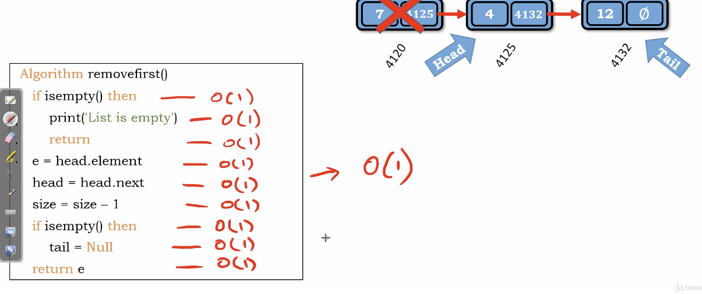

# Idea

我們要的是head的value，e.head.element
原本的head node會自動地被gc回收掉，在其他程式語言之中，要自己回收

Edge case : 

    1. 如果一開始就是空的，return
    2. head assign到下一個後，若只剩一個Node，將tail指爲Null

</img>

``` Python
Algorithm remove_first()
    if is_empty() then
        print('List is empty')
        return
    e = head.element
    head = head.next
    size -= 1
    if is_empty() then
        tail = Null
    return e

```

Time Complexity : $O(1)$

Space Complexity : $O(1)$
