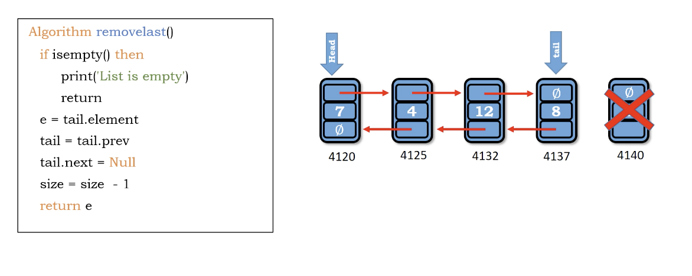

# Stack

1. collections of objects
2. Last in first out(LIFO)

</img>
</img>

# glossary

1. top (tail)
2. bottom（head）

# Operation

1. push - add something into stack
2. pop - take out something from stack

# Applications

1. Web beowser history
2. Undo operations in editing applications
3. HTML document tags matching
4. parentheses matching(程式語言中的括號對齊)
5. infix to postfux (某種格式轉換)

# Stack ADT

</img>

# Implementing

1. Arrays
2. Linked List
