# Queue

1. collections of objects
2. First-In First Out - different between Stack(Last in first out(LIFO))

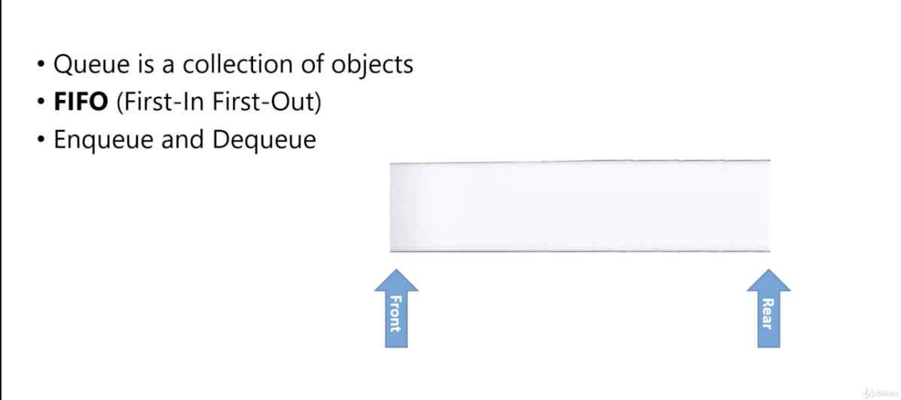</img>
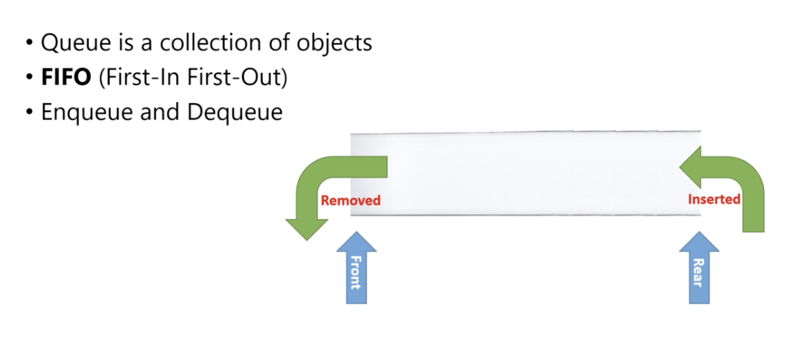</img>

# glossary

1. front (head)
2. rare (tail)

# Operation

1. Enqueue - add something into queue
2. Dequeue - take out something from queue

# Enqueue

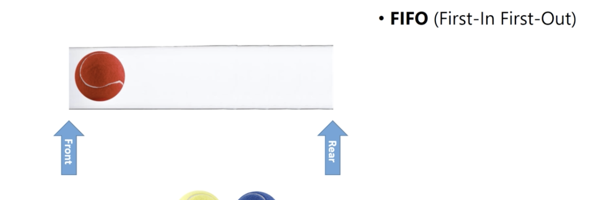</img>
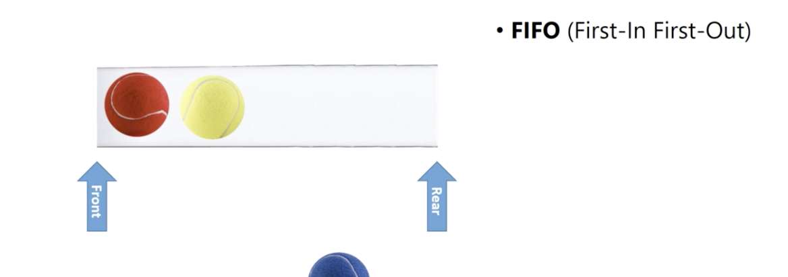</img>
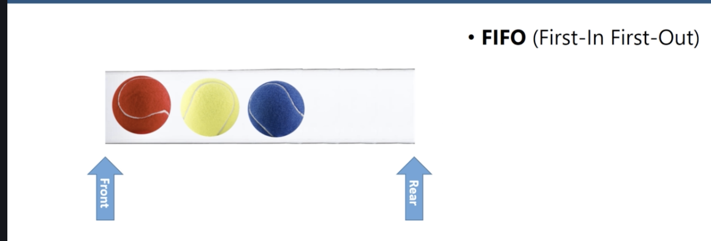</img>

# Dequeue

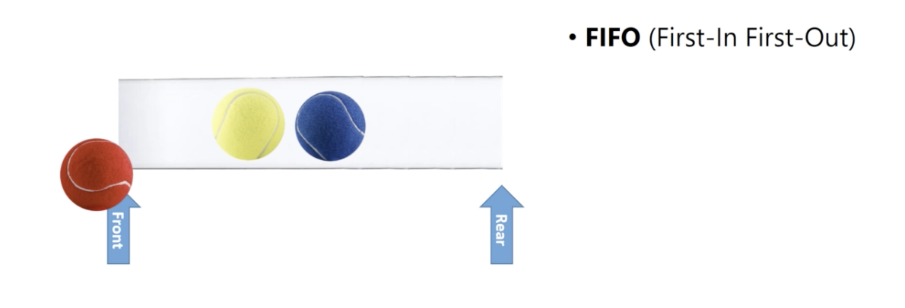</img>

# Applications

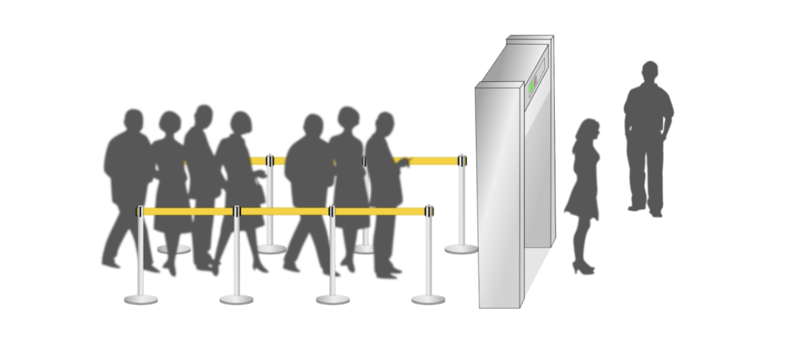</img>
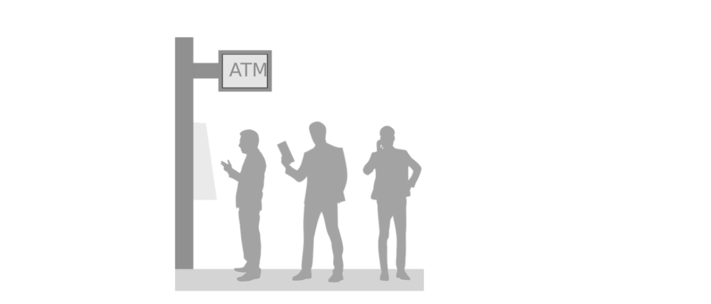</img>
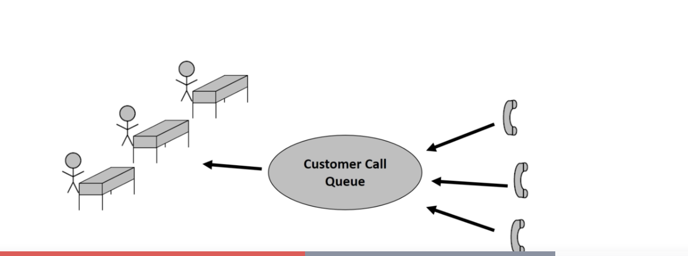</img>
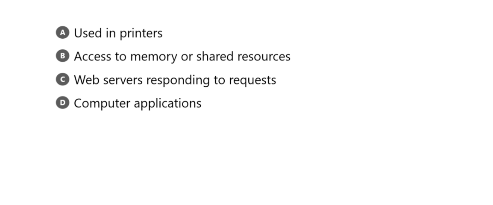</img>

1. lines in shopping center.
2. lines at atm.
3. customer call center(first customer first!)
4. file to the printer(first file first to print!)
5. web servers responding to requests(first request first!)
6. a lot of computer application which first need to take care first.

# Queue ADT

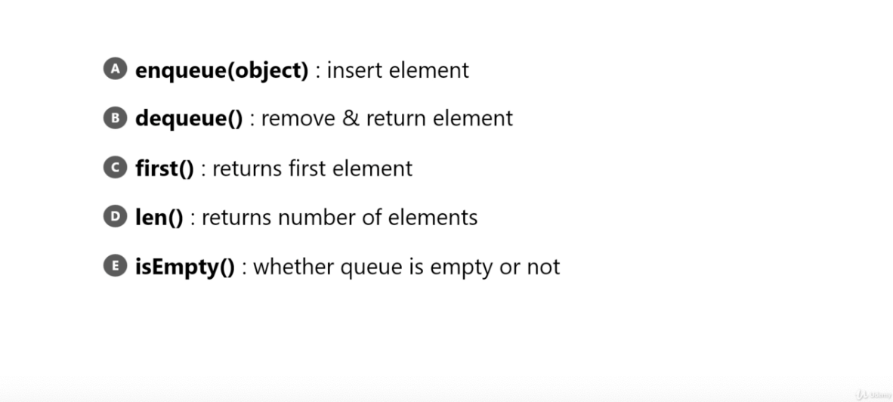</img>

# Implementing

1. Arrays
2. Linked List
