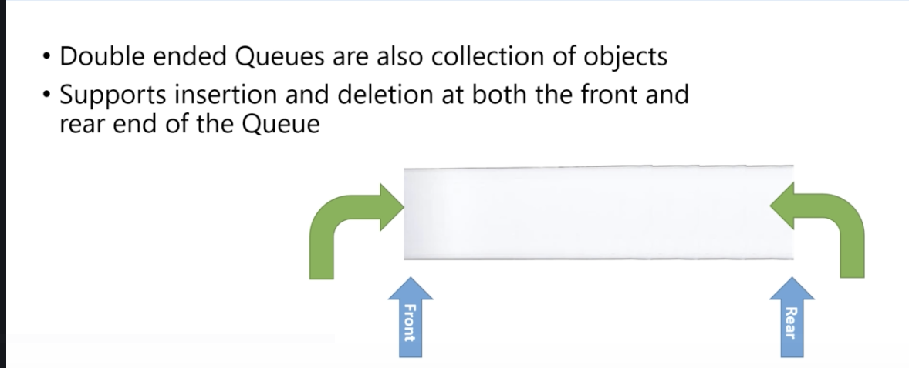
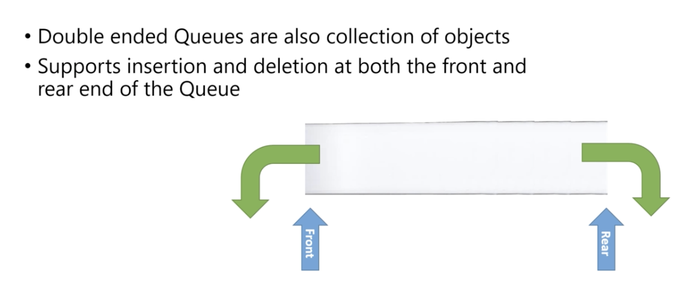
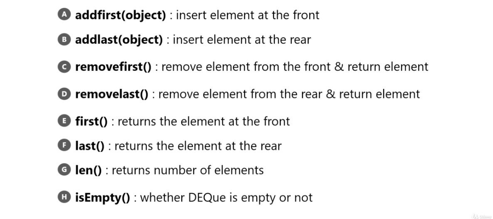

# Double ended Queues

Do not get confused with the dequeue method of the queue and DEQue

Queue : one way in, one way out. Not very uesful.

</img>
</img>

# Example?

People in the resaurant.

When you get a meal, you are out of the DEQue(front)

When you wanna get out of the line, you are out of the DEQue(tail)

# Implementation

</img>

Array and Linked
